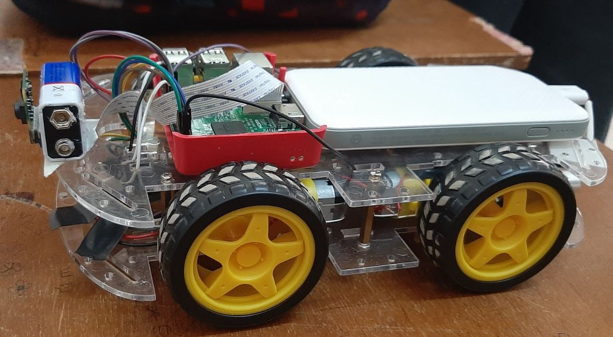
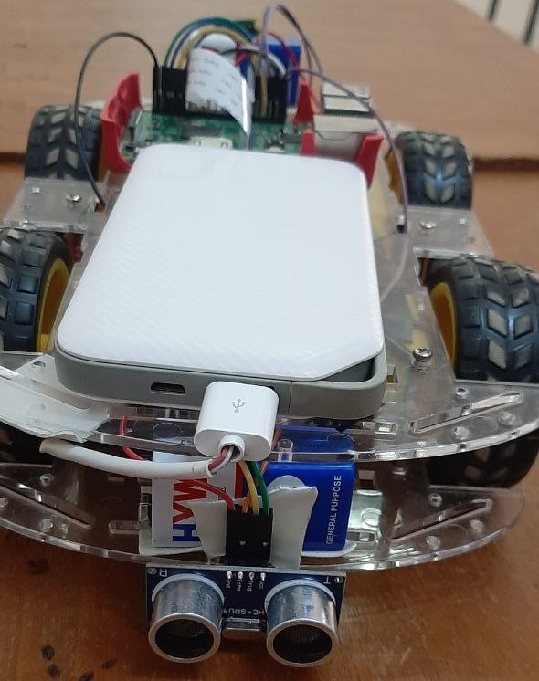
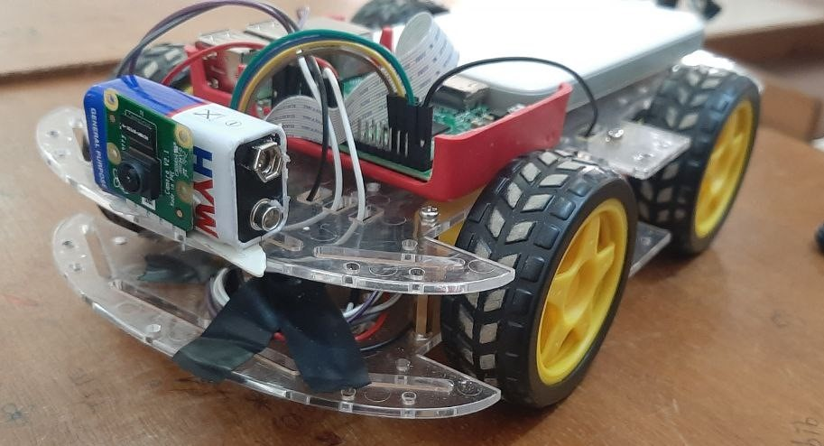

# Remote Controlled Car Robot Web Server using Raspberry and picam

In this IoT mini-Project we are using a Pi camera with Raspberry Pi 3 to build **Raspberry Pi Web Controlled Robot** .It has a Picam camera mounted over it, through which we will get live video feed and an Ultrasonic Sensor in the back of the car used to detect objects and determine the distance of the obstacle from the sensor .The interesting part here is that we can control and move this robot from a web browser over the internet. We built a webpage in HTML which has Left, Right, UP, Down links, clicking on which we can move the robot in any direction , the interface contains the live video feed and a progress bar to monitor the back ; detects if there is any object behind the car. We used “Motion” for getting live Video feed from Pi camera and used “Flask” for sending commands from webpage to Raspberry Pi using python to move the Robot.

### Components Required :
 - Raspberry Pi 3 with memory card
 - Ultrasonic Sensor Module HC-SR04
 - Pi Camera
 - DC Motors (4)
 - L293D Motor Driver Module
 - ROBOT Chassis complete with screw
 - Power bank

Here is a demonstration:

https://github.com/1b71h3l/Project_ES/assets/74022204/3a8685e7-ea26-4900-9313-a6eb56fca284

https://github.com/1b71h3l/Project_ES/assets/74022204/44ead75d-c7fb-440a-8c03-c0c5c7b6edd7

